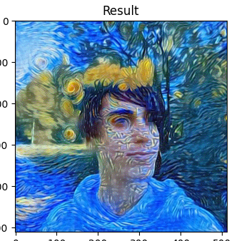

# Стилизация изображений
### Содержание
1. [Описание](#title1)
2. [Структура проекта](#title2)
3. [Технологии](#title3)
4. [Результаты](#title4)
    - 4.1. [Алгоритм Гатиса](#title4.1)
    - 4.2. [AdaIN-стилизатор](#title4.2)
    - 4.3. [Демонстрация работы телеграм-бота](#title4.3)
5. [Установка и запуск проекта](#title5)
   

## <a id="title1">1.Описание.</a>
Проект состоит из двух частей:
1. Изучение и имплементация основных подходов к решению задачи NST(neural style transfer). Задача - переносить __произвольный__ стиль с одного изображенеия на другое.
2. Разработка телеграм-бота, предоставляющего удобный пользовательский интерфейс для стилизации изображений. 

В рамках первой части проекта сначала были выделены два наиболее популярных подхода:
* Алгоритм Гатиса: https://arxiv.org/pdf/1508.06576
* AdaIN-блок для решения задачи стилизации: https://arxiv.org/pdf/1703.06868

Затем были сформулированы конкретные задачи:
1. Имплементация приведённых выше статей в удобочитаемых ноутбуках с подробным разбором и комментариями.
2. Проведение экспериментов с параметрами алгоритма Гатиса с целью минимизации времени получения стилизации.
3. Обучение архитектуры с AdaIN-блоком.
4. Сравнение полученных решений и последующее их встраивание в телеграм-бота.
   
> [!IMPORTANT]
> Пункт 2 из списка выше имеет __критически важное__ значение, поскольку скорость создания стилизации напрямую влияет на восприятие пользователя.


## <a id="title2">2.Структура проекта.</a>
```
root/
├── tg-bot/          # Телеграм-бот
└── materials/       # Ноутбуки и .md-файлы с разбором основных методов стилизации изображений
    ├── online-nst/  # Разбор и имплементация алгоритма Гатиса
    ├── adain/       # Разбор, имплементация и обучение архитектуры, основанной на AdaIN-блоке
    ├── test-data/   # Тестовые картинки для оценки качества  
```


## <a id="title3">3.Технологии.</a>
### Tg-bot
* aiogram
* Redis - хранилище для FSM; брокер сообщений;
* Celery - очередь задач для выполнения стилизации в отдельном потоке;
### Ml-stack
* torch, torchvision
* MLflow (логгирование экспериментов)


## <a id="title4">4.Обзор результатов.</a>
### <a id="title4.1">4.1. Алгоритм Гатиса.</a>
#### 4.1.1. Бейзлайн
Ознакомиться с реализацией алгоритма Гатиса с подробными комментариями можно в ноутбуке: `./materials/online-nst/gatys_baseline.ipynb`

Для бейзлайна были взяты следующие значения гиперпараметров оптимизации:
| Параметр               | Значение |
| ---------------------- | -------- |
| Количество слоев VGG19 | 11       |
| Оптимизатор            | Adam     |
| Learning rate          | 0.05     |
| Количество итераций    | 300      |
| Scheduler              | -        |
| Gamma                  | -        |
| Размер изображений     | 256      |

В процессе тестирования было измерено среднее время получения стилизации и средние значения потерь контента и стиля:

| Среднее время стилизации (CPU), c | Content Loss | Style Loss |
| --------------------------------- | ------------ | ---------- |
| 69.6634                           | 0.041467     | 0.002046   |

Были получены неплохие стилизации:

 


__Вывод:__ Результаты получились неплохие, но есть еще пространство для исследований и потенциальных улучшений. Во-первых, есть проблема со скоростью получения стилизации - на CPU (а запускать бота планируется именно на CPU) она в среднем занимает 70 секунд. Во-вторых, получаемые на выходе изображения заимствуют у стиля в основном цветовую гамму, интересно научиться переносить ещё и какие-то более высокоуровневые паттерны(узоры, линии, формы). Поэтому следующим этапом проведём ряд экспериментов, связанных с количеством используемых слоёв VGG19, с количеством эпох и скоростью обучения. 

#### 4.1.2. Влияние количества слоёв на качество стилизации
Эксперимент выполнен в ноутбуке: `./materials/online-nst/vgg_layers.ipynb`.

| Общий параметр         | Значение |
| ---------------------- | -------- |
| Оптимизатор            | Adam     |
| Learning rate          | 0.05     |
| Количество итераций(cpu)| 300     |
| Количество итераций(gpu)| 400     |
| Scheduler              | -        |
| Gamma                  | -        |
| Размер изображений(cpu)| 256      |
| Размер изображений(gpu)| 512      |

Результаты экспериментов в таблице ниже:

| <center>№</center> | vgg_depth | time_gpu | time_cpu | content_loss  | style_loss  | 
| ------------------ | --------- | -------- | -------- | ------------- | ----------- | 
| 1(бейзлайн)        | 11 (5)    | 10.7481  | 70       | 0.03141       | 0.00153     |
| 2                  | 18 (8)    | 15.6     | 104.8858 | 0.04154       | 0.000550    | 
| 3                  | 35 (17)   | 23.75679 | 170.1987 | 0.038         | 0.002756    |

Примеры полученных результатов:


Неплохо получился перенос стиля звёздной ночи в эксперименте, првоодимом на GPU (400 эпох, размер изображений 512):



Модель хорошо уловила черты картины и перенесла "звёзды". Бейзлайн решение смогло перенести только основные штрихи и цветовую палитру.


__Вывод:__ более глубокие модели способны вытягивать из стиля более высокоуровневые паттерны(узоры, формы, линии), например, на изображениях выше модель лучше распознала узор красных лепестков на первой картинке и треугольный паттерн на второй картинке. На этих примерах бейзлайн справился хуже. Однако по времени использование бОльшего количество слоёв обходится значительно дороже. Следующим этапом будем уменьшать количество эпох, минимизируя потери в качестве стилизации. 

#### 4.1.3. Итог. Формирование решения для телеграм-бота.
После проведения ещё ряда экспериментов было сформировано следующее решение для телеграм-бота:
1. Использовать все слои VGG-19.
2. Давать возможность пользователю выбирать степень стилизации, чем выше меньше выбранная степень - тем быстрее стилизация (но менее выраженная).

Для степеней стилизации были подобраны оптимальные наборы параметров:

| Cтепень стилизации ->     | 1          | 2          | 3          | 4          | 5     |
| ------------------------- | ---------- | ---------- | ---------- | ---------- | ----- |
| Learning rate             | 0.05       | 0.05       | 0.05       | 0.08       | 0.08  |
| Количество итераций       | 20         | 40         | 60         | 100        | 200   |
| Scheduler                 | -          | -          | -          | -          | 25    |
| Gamma                     | -          | -          | -          | 0.85       | 0.85  |
| Content_Layers            | 14, 15, 16 | 14, 15, 16 | 14, 15, 16 | -          | -     |
| Style_Layers              | 1-6        | 1-8        | 1-10       | 1-17       | 1-6   |
| Время стилизации (CPU), с | 11.18      | 22.41      | 33.05      | 56.73      | 80    |


### <a id="title4.2">4.2. AdaIN-стилизатор.</a>
Имплементация статьи https://arxiv.org/pdf/1703.06868 находится в ноутбуке `./materials/adain/adain_style_transfer.ipynb`.

Для обучения модели были взяты следующие датасеты:
* MsCoco - изображения контента (https://www.kaggle.com/datasets/hariwh0/ms-coco-dataset)
* Wiki-art - изображения стилей (https://www.kaggle.com/datasets/steubk/wikiart)

#### 4.2.1. Первая попытка обучения
На текущий момент была предпринята одна попытка обучения реализованной архитектуры. Модель обучалась в течение 6 эпох на GPU (что заняло приблизительно 12 часов) на платформе Kaggle со следующими параметрами обучения:

| Параметр               | Значение |
| ---------------------- | -------- |
| Оптимизатор            | Adam     |
| Learning rate          | 0.001    |
| Количество эпох        | 6        |
| Scheduler              | 100      |
| Gamma                  | 0.9995   |


Добиться удовлетворительного результата не удалось, декодер модели научился восстанавливать контуры исходного изображения, однако с переносом стиля модель не справилась. Выходные изображения получаются однотипными, размытыми, с отсутствием стиля:

 

__Анализ и дальнейшие шаги:__ изменение лоссов и выход нейросети говорят о недообучении модели, она не смогла сойтись к минимуму лосс-функции. Скорее всего, это результат достаточно большого значения learning_rate = 0.001 и редкого его уменьшения(каждые 100 итераций). Поэтому первое решение проблемы - уменьшение learning_rate. 


### <a id="title4.3">4.2. Демонстрация работы телеграм-бота.</a>


## <a id="title5">5. Установка и запуск проекта</a>
Will be soon...
